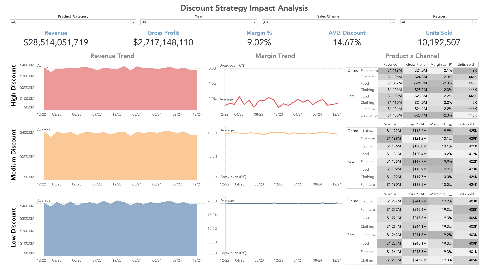

# Discount Strategy Impact Analysis

## 📌 Project Overview

This project analyzes how discount strategies affect revenue growth and profitability across a retail business operating in Online and Retail sales channels during 2023–2024.

The analysis was designed to answer a pricing and profitability question raised by a hypothetical VP of Sales, who observed that sales were increasing but overall profitability was not improving as expected. The company had been using increasingly aggressive discounts to stimulate demand, raising concerns that higher sales volume might be coming at the expense of gross profit and margin.

Using SQL, I created discount tiers (High, Medium, and Low) and calculated core financial metrics including Revenue, Cost of Goods Sold (COGS), Gross Profit, Margin %, Units Sold, and Average Discount. Tableau was then used to build an interactive dashboard comparing revenue and profitability across discount levels, product categories, sales channels, and regions.

This project is structured as a business-oriented pricing analysis focused on evaluating whether aggressive discounting generates sustainable growth or simply erodes profitability.

---

## ❓ Key Questions

This project focuses on answering the following business and analytical questions:

- Do discounts above 20% generate enough additional revenue to justify lower margins?
- Which discount tier offers the best balance between sales growth and profitability?
- Does aggressive discounting materially increase units sold?
- Are certain product categories more sensitive to discounting?
- Do Online and Retail channels respond differently to pricing strategy?
- Are profitability issues concentrated within specific segments rather than at the overall channel level?

---

## 🧩 Stakeholder Scenario

A VP of Sales raised the following concern:

> “Our sales have been growing, but profitability doesn’t seem to be improving the way we expected. We’ve been offering more discounts to drive growth, and I’m starting to wonder whether those discounts are actually helping us or just eroding our margins.”

To better define the analysis, I asked clarifying questions around:

- How profitability should be measured (Gross Profit and Margin %)
- Which channels and product categories were of concern
- What time period should be analyzed
- What level of discounting should be considered aggressive
- What business decisions the analysis should support

The initial concern was narrowed into a specific objective focused on discount thresholds and their impact on financial performance.

---

## 🎯 Project Objective

Determine whether discounts above 20% generate enough additional revenue and sales volume to justify declines in gross profit and margin percentage across product categories, sales channels, and regions during 2023–2024.

---

## 🧪 Hypotheses Tested

The analysis was structured around several hypotheses:

1. High discounts increase revenue.
2. High discounts compress margins.
3. Certain product categories, particularly Electronics, are more sensitive to discounting.
4. Online sales rely more heavily on discounts than Retail.
5. Customer behavior may vary across segments.

These hypotheses guided the SQL analysis and dashboard design.

---

## 📊 Dashboard Preview

---

## 🔗 Interactive Dashboard

View the fully interactive dashboard on Tableau Public:

[Open Dashboard in Tableau Public](https://public.tableau.com/app/profile/omar.muniz/viz/DiscountStrategyAnalysis/Dashboard1?publish=yes)

---

## 📈 Key Findings

### Overall Business Performance

- Revenue: **$2.85B**
- Cost of Goods Sold (COGS): **$2.58B**
- Gross Profit: **$271.7M**
- Gross Margin: **9.53%**
- Units Sold: **10.19M**
- Average Discount: **15.0%**

**Insight:**  
The business operates at significant scale, but more than 90% of revenue is consumed by inventory cost, leaving relatively narrow gross margins and making profitability highly sensitive to pricing and discount decisions.

---

### Sales Channel Performance

- Online and Retail channels produced nearly identical overall margins (~9.53%).

**Insight:**  
The Online channel was not structurally less profitable than Retail. Any profitability concerns were concentrated within smaller segments rather than at the overall channel level.

---

### Product Category Analysis

- Online Electronics showed nearly identical revenue, discount levels, and margins compared with Retail Electronics.

**Insight:**  
There was no evidence that Online Electronics was disproportionately dependent on discounting, suggesting the issue was more closely related to discount thresholds than to specific channels.

---

### Discount Tier Comparison

#### High Discount (>20%)

- Average margin: approximately **-2.2%**
- Consistently below break-even across all months
- Generated strong revenue but negative gross profit

#### Medium Discount (10–20%)

- Average margin: approximately **10%**
- Maintained strong revenue while preserving positive profitability

#### Low Discount (<10%)

- Average margin: approximately **19%**
- Delivered the highest profitability with comparable revenue performance

**Insight:**  
Revenue remained relatively similar across all discount tiers, but profitability declined dramatically as discounts increased. Transactions discounted above 20% consistently generated negative margins across all categories and channels.

---

## 🧠 Final Takeaways

- Higher discounts did not materially increase revenue.
- Discounts above 20% consistently destroyed profitability.
- Medium discounts offered a balanced trade-off between growth and margin preservation.
- Low discounts generated the strongest and most sustainable profitability.
- Pricing strategy had a greater impact on profitability than channel differences.

---

## 💡 Business Recommendation

Restrict discounts above 20%, as they consistently generated negative margins without producing materially higher revenue.

Prioritize medium discount levels (10–20%) to maintain strong sales performance while preserving profitability, and use low discount strategies where possible to maximize gross margin and long-term financial performance.

---

## 📘 Key Metrics & Definitions

- **Revenue:** Total sales generated after discounts
- **COGS (Cost of Goods Sold):** Direct cost of products sold
- **Gross Profit:** Revenue minus COGS
- **Margin %:** Gross Profit ÷ Revenue
- **Units Sold:** Total quantity sold
- **Average Discount:** Mean discount applied across transactions
- **Discount Tier:** High (>20%), Medium (10–20%), Low (<10%)

---

## 🛠 Tools Used

- SQL (Data Preparation, KPI Calculation, and Aggregation)
- Tableau (Interactive Dashboard and Visualization)
- GitHub (Documentation and Portfolio Presentation)

---

## 📎 Personal Takeaway

I did not force the data to confirm my initial assumptions.

Instead, I clarified the stakeholder’s concern, developed hypotheses, tested them systematically, and allowed the evidence to guide the final conclusion.

This project reinforced one of the most important principles in analytics:

> Strong analysts do not search for confirmation—they search for the truth.

## 📂 Project Files

- [SQL Analysis Script](sql/discount_strategy_analysis.sql)
- [Detailed Project Notes](docs/project_notes.md)
